# Toons Quiz

Visit the deployed site: [Toons Quiz](https://gokwori.github.io/Toons-Quiz/)

Welcome to the Toons Quiz Game! A thrilling interactive web application designed to test your knowledge and love for the colorful world of cartoons. Whether you’re a die-hard fan of classic animations or a follower of the latest animated series, this game is crafted just for you.

Dive into a vibrant journey through various questions ranging from the golden age of cartoons to the contemporary masterpieces that have captured the hearts of millions. Our app challenges you with an array of questions that will intrigue both casual viewers and avid enthusiasts.

 
 
 
 
 
 
 
 

## CONTENTS

* [User Experience](#user-experience-ux)
  * [Project Goal](#project-goal)
  * [First Time User Goal](#first-time-user-goal)
  * [Returning User Goal](#returning-user-goal)
  * [Frequent User Goal](#frequent-user-goal)
  * [Business Goal](#business-goal)
  * [User Stories](#user-stories)
  
* [Design Choices](#design-choices)
  * [Colour Scheme](#colour-scheme)
  * [Typography](#typography)
  * [Imagery](#imagery)
  * [Wireframes](#wireframes)
  * [Features](#features)
    * [The Home Page](#the-home-page)
    * [The How To Play Page](#the-how-to-play-page)
    * [The High Score Page](#the-high-score-page)
    * [The Difficulty Level Page](#the-difficulty-level-page)
    * [The Game Page](#the-game-page)
    * [The Exit Game Page](#the-exit-game-page)
    * [The End Game Page](#the-end-game-page)
    * [The Settings Page](#the-settings-page)
    * [Future Implementations](#future-implementations)
  * [Accessibility](#accessibility)

* [Technologies Used](#technologies-used)
  * [Languages Used](#languages-used)
  * [Frameworks, Libraries & Programs Used](#frameworks-libraries--programs-used)

* [Deployment & Local Development](#deployment--local-development)
  * [Deployment](#deployment)
  * [Local Development](#local-development)
    * [How to Fork](#how-to-fork)
    * [How to Clone](#how-to-clone)

* [Testing](#testing)
  * [Solved Bugs](#solved-bugs)
  
* [Credits](#credits)
  * [Code Used](#code-used)
  * [Content](#content)
  * [Acknowledgments](#acknowledgments)

- - -

## User Experience (UX)

### Project Goal

The primary goal of the Toons Quiz Game is to create an engaging, interactive web application that offers users a fun and educational way to test their knowledge of cartoons. This project aims to deliver an immersive experience where users can interact with the site in their unique way to achieve their personal goals and find answers to their specific questions.

By leveraging HTML, CSS, and JavaScript, this app will present interactive data in a user-friendly manner, allowing for dynamic interaction and a tailored experience based on user input. The quiz will feature a variety of questions related to cartoons across different eras, challenging users of all ages and fostering a deeper appreciation and understanding of the animated world.

Through this project, I seek to not only entertain users but also to provide a platform for learning and engagement.

### First Time User Goal

For first-time users venturing into the Toons Quiz Game, the objective is to offer an inviting, easy-to-navigate platform that sparks interest and curiosity about cartoon trivia. This project seeks to provide a smooth onboarding experience that quickly demonstrates the game's value and entertainment potential without overwhelming newcomers.

First-time users are guided through a brief introduction that highlights key features and gameplay mechanics, ensuring they feel confident and prepared to start their trivia journey. The game offers a selection of starter questions that cover a broad range of easily recognizable cartoons, making initial engagement fun and encouraging continued exploration.

By balancing educational content with entertainment, the game aims to pique the curiosity of first-time users, inviting them to dive deeper into the world of cartoons and discover the breadth and depth of content available. Through a user-friendly interface and positive early interactions, first-time users are motivated to transition from casual players to regular participants.

### Returning User Goal

For returning users, the goal is to reinforce the positive experience had during their initial play, providing enough variety and challenge to encourage continued engagement and deeper involvement. The Toons Quiz Game seeks to build on the foundation laid during the first visit by offering personalized content, remembering user preferences, and presenting new questions and challenges that match their growing expertise.

### Frequent User Goal

For frequent users, the Toons Quiz Game aims to deepen their connection to the game and its community, offering advanced challenges, opportunities for social interaction, and recognition for their dedication and achievements. This project seeks to transform frequent users into ambassadors of the game, leveraging their enthusiasm to foster a vibrant and welcoming community.

Frequent users are offered access to exclusive content, such as advanced difficulty levels that challenge even the most knowledgeable cartoon aficionados. The game encourages active participation in community discussions, content creation, and feedback sessions, allowing frequent users to contribute to the game's development and direction.

Recognition plays a key role in rewarding frequent users, with achievements, leaderboard rankings, and special accolades highlighting their contributions and expertise. This recognition not only serves to celebrate their accomplishments but also motivates others within the community to reach similar heights.

### Business Goal

The primary business goal of the Toons Quiz Game is to establish a vibrant, engaging online platform that not only entertains users but also fosters a community around a shared love for cartoons. By providing an interactive and educational experience, the game aims to attract a diverse audience, from casual players to trivia enthusiasts and competitive gamers, thereby increasing user engagement and retention.

## User Stories

### First-Time Users

- **Exploring the Interface**:  
  *I want the site to be intuitive and welcoming, so I can easily understand how to start playing and navigate the game without feeling lost.*

- **Discovering Content**:  
  *I'm interested in finding out what types of cartoons the quiz covers, hoping to see a mix of familiar and new content that piques my curiosity.*

- **Learning How to Play**:  
  *I want clear instructions or a quick tutorial on how the game works, ensuring I have a positive experience right from the start.*

### Returning Users

- **Tracking Progress**:  
  *I would like to see my previous scores or progress when I return, giving me a sense of achievement and a reason to improve.*

- **New Challenges**:  
  *I'm looking for new questions or quizzes that have been added since my last visit, so the game continues to be challenging and engaging.*

- **Personalized Experience**:  
  *I appreciate any customization or recommendations based on my past interactions, making my return visits more relevant and enjoyable.*

### Frequent Users

- **Community Engagement**:  
  *I want to participate in a community of fellow cartoon enthusiasts, where I can share experiences, compete, and discuss trivia.*

- **Exclusive Content**:  
  *As a loyal player, I'm interested in accessing exclusive quizzes, challenges, or rewards that acknowledge my frequent engagement.*

#### As the game developer

*I want to attract a broad user base and keep them engaged so that the site can grow in popularity and explore potential monetization opportunities.
*I need to ensure the game is accessible to all users, including those with visual impairments, to adhere to inclusivity standards and expand the game's reach.

- - -

## Design Choices

### Colour Scheme

In designing the Quiz game website, a carefully curated colour palette was chosen to complement the site's aesthetic and functionality, featuring `#091f34` (deep navy blue), `#FFA500` (vibrant orange), and `#fff` (white) as primary elements. Additionally, specific colours are employed to visually signify correctness and incorrectness within the game interface: `#10862b` (green) for correct answers and `#8d111e` (red) for incorrect ones.

* `#091f34` provides a sophisticated, deep blue backdrop, enhancing the visual depth and setting a professional tone for the site.
* `#FFA500` is used to draw attention and guide user interaction, injecting vibrancy and energy into the quiz experience.
* `#fff` ensures text is clear and readable against the website's darker backgrounds.
* `#10862b` (green) visually communicates correct answers, reinforcing positive feedback and achievement.
* `#8d111e` (red) highlights incorrect choices, serving as an intuitive cue for users to learn and adapt their knowledge.

This combination of colours not only creates a visually appealing interface but also incorporates colour-coded feedback mechanisms (`#10862b` for correct answers and `#8d111e` for incorrect ones) to enhance the interactive learning experience. The result is a harmonious, engaging atmosphere that supports the quiz's educational goals while ensuring a delightful user experience.

The primary and accent colours utilized across the site for textual and interactive elements are `#091f34`, `#FFA500`, and `#fff`, with `#10862b` and `#8d111e` specifically used within the quiz for feedback on user responses.

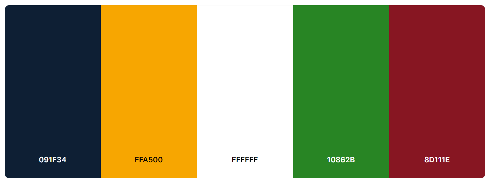

### Typography

For the typography of the Quiz game website, Google Fonts was leveraged to import and integrate a font that complements the playful and engaging theme of the site.

* Primary Font: Comic Neue - Chosen for its modern reinterpretation of the traditional comic book font, Comic Neue adds a fun and legible touch to the user interface. Its design strikes a balance between playfulness and readability, making it an ideal choice for the cartoon trivia theme of my game. This font embodies the essence of the animated world, enhancing the overall user experience with its approachable and appealing appearance.

The use of Comic Neue throughout the site not only reinforces the thematic elements of the game but also ensures that text is easy to read and interact with, thereby improving usability and accessibility for players of all ages.

### Imagery

The imagery used in the Quiz game website plays a pivotal role in creating an immersive and visually appealing experience that captivates users and enhances the thematic focus on cartoons and animation. Each visual element has been carefully selected and integrated to complement the game's design and user interface, providing a rich and engaging atmosphere that resonates with fans of animated content.

* Background Images: The background of the website features high-resolution images inspired by popular animations, such as "Kung Fu Panda." These images set a vibrant and dynamic tone for the game, inviting users into the whimsical world of cartoons. The backgrounds are sourced from [Wall AlphaCoders](https://wall.alphacoders.com/big.php?i=690190), ensuring that they are of high quality and contribute positively to the aesthetic appeal of the site.

* Iconography and Logo: The website's logo and icons are designed to echo the playful and animated theme of the quiz. The logo (sourced from [Wallpaperaccess](https://wallpaperaccess.com/3d-cartoon#google_vignette)), featuring a stylized representation of cartoon elements, serves as a visual anchor for the site, reinforcing the game's identity and purpose. The icons used throughout the site, are chosen for their clear visual communication, thematic consistency and sourced from [Font Awesome](https://fontawesome.com/icons) . 

### Wireframes

Toons Quiz Game's development process began with the creation of detailed wireframes using Balsamiq wireframes. These wireframes served as blueprints for the game's design, ensuring a user-friendly interface and a seamless experience across various screens.

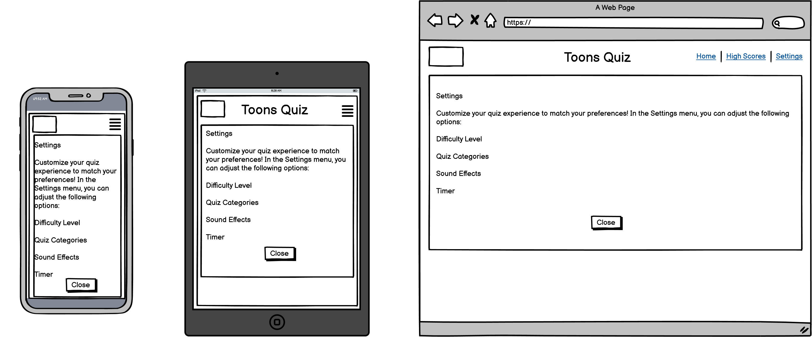

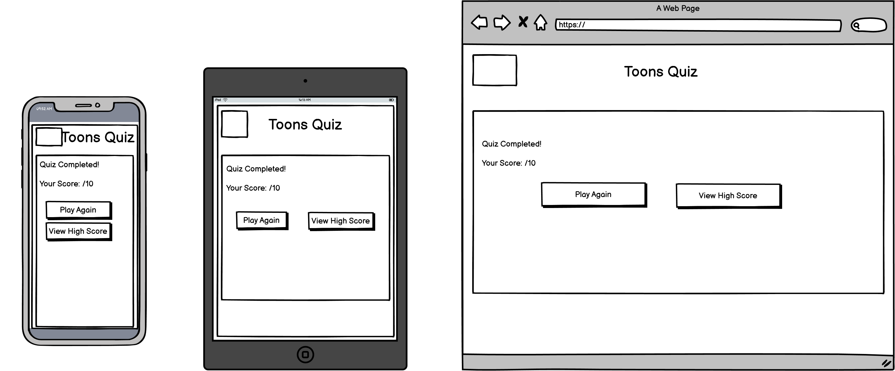

### Features

The Toons Quiz Game offers an engaging online platform, consisting of a series of interactive pages including the Home Page, How-to-Play, High Scores, Difficulty Level Selection, Quiz Game, End Game, Exit Game Confirmation, and Settings. Designed to cater to both casual browsers and avid quiz enthusiasts, the game ensures a seamless user experience across various devices with its responsive design.

All Pages Feature:

* `A Favicon`: Visible in the browser tab for easy identification.

  

* `Consistent Navigation`: Each page features a header with the site's title, "Toons Quiz," which doubles as a clickable link redirecting users back to the Home Page. The navigation design is consistently intuitive across the site, enhancing user experience.

  

* `Dynamic Background Music`: The site incorporates an option for background music, which continues seamlessly across pages without restarting, thanks to sophisticated sound settings that remember user preferences.

  

* `Dark/Light Mode`: Users can customize their visual experience by toggling between dark and light themes, ensuring comfort and accessibility.

  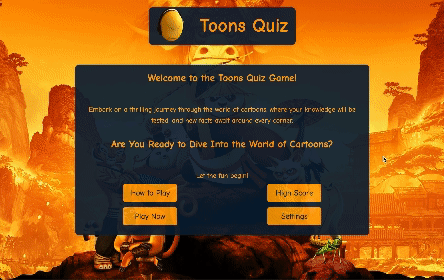

* `Interactive Features`: Including visual feedback for correct or incorrect responses, and the ability to save high scores to foster competitive play.

  |Visual Feedback for answers|Save Highscores|
  | --- | --- |
  |||

Special Page Features:

#### The Home Page

The Home Page of the Toons Quiz Game serves as the gateway to a vibrant and engaging journey through the world of animated trivia. Designed with attention to detail and user engagement at its core, this page sets the tone for an exciting quiz experience. Here's a detailed overview of its features:

* `Welcoming Interface`: Upon arrival, players are greeted with a captivating and visually appealing interface. The use of engaging graphics and a dynamic colour scheme immediately draws attention and sets an upbeat mood for the quiz.

* `Introduction and Invitation to Play`: A brief introduction provides players with a snapshot of what to expect. Coupled with a direct invitation to start the game, it ensures that new visitors are quickly and effectively onboarded.

* `How to Play Guide`: A dedicated section to a "How to Play" guide offers players insights into game mechanics, rules, and tips. This resource is invaluable for first-time visitors, ensuring they feel equipped and confident to begin their quiz journey.

* `High Score Access`: A section to view the High Scores encourages a sense of competition and achievement. Players can see the top scores to beat, adding an extra layer of motivation.

* `Difficulty Level Selection`: Direct access to choose the quiz difficulty level allows players to tailor their experience according to their knowledge and skill level, enhancing personalization and satisfaction.

* `Settings Customisation`: Options to customise settings, such as toggling sound or selecting a theme, provide players with control over their gaming environment, ensuring a comfortable and personalised experience.

* `Engaging Background Music`: The continuous play of background music enhances the immersive experience. With controls to adjust the audio, players can customize their auditory experience to match their preference.

* `Mobile Responsiveness`: Recognizing the diversity of player devices, the Home Page is designed to be fully responsive. This ensures that the game is accessible and enjoyable on various screens, from desktops to smartphones.

#### The How To Play Page

The "How to Play" page of the Toons Quiz Game provides concise, easy-to-follow instructions tailored for players of all ages and skill levels. Here's what it includes:

* `Clear Instructions`: Brief steps guide players from starting a game to navigating through questions and selecting answers.

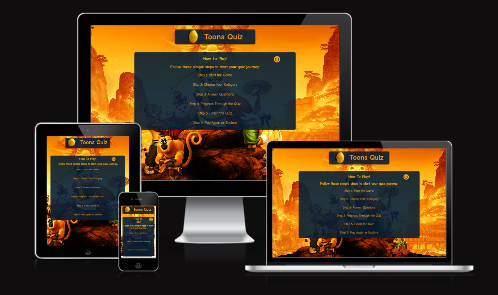

#### The High Score Page

The High Score page stands as a motivational hub for the Toons Quiz Game, showcasing the achievements of top players. Here's a snapshot of its features:

* `Leaderboard Display`: Lists the top scores in a clear, easy-to-navigate format, celebrating player success.

* `Dynamic Updates`: Scores are updated in real-time, ensuring that new achievements are promptly recognised.

* `Player Names`: Alongside scores, players' names or chosen aliases are displayed, adding a personal touch.

* `Reset Option`: Includes a feature for clearing the leaderboard, allowing for fresh competition and new entries.

* `Navigation Ease`: Direct links enable quick transitions to start a new game or adjust game settings, encouraging continuous play.

* `Inspirational Element`: Acts as a challenge to new and returning players to surpass existing high scores.

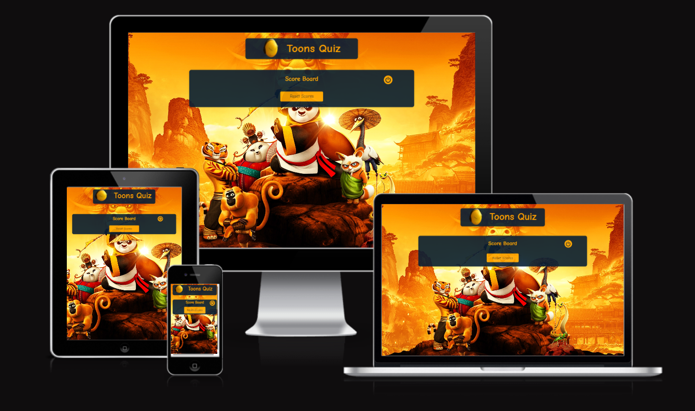

#### The Difficulty Level Page

The Difficulty Level page in the Toons Quiz Game serves as a crucial juncture for players, tailoring the game's challenge to their preference. Here's what it entails:

* `Customisable Experience`: Offers a choice between `Easy,` `Medium,` and `Hard` levels, allowing players to align the game's difficulty with their comfort and skill level.

* `Immediate Impact`: The selected difficulty level dynamically adjusts the questions' complexity, ensuring a tailored quiz experience right from the start.

* `Sleek Design`: With clear, accessible buttons for each difficulty level, the interface is user-friendly, making the selection process straightforward and quick.

* `Adaptive Challenge`: Encourages players to experiment with different levels of difficulty, promoting learning and gradual improvement over time.

* `Preparation Step`: Acts as a preparatory step before the game, setting expectations and building anticipation for the challenge ahead.

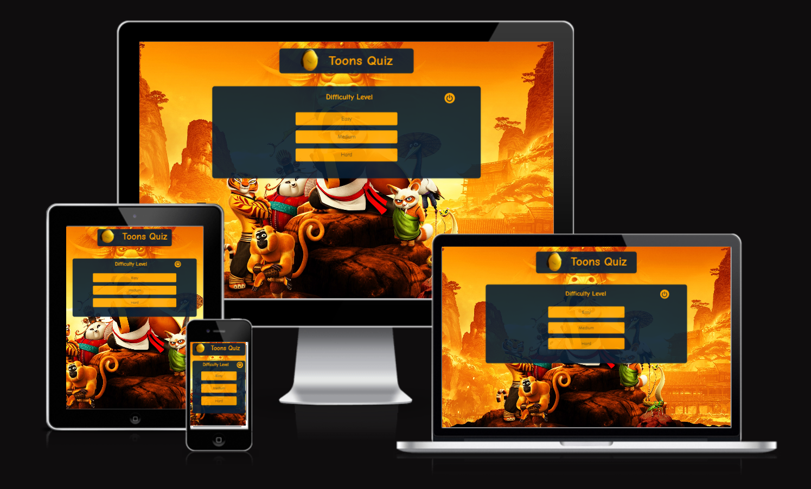

#### The Game Page

The Game Page is the heart of the Toons Quiz Game, where players' knowledge is put to the test through a series of cartoon-related questions. Here's what makes it stand out:

* `Dynamic Question Display`: Features a mix of questions tailored to the selected difficulty level, ensuring a varied and challenging experience.

* `Interactive Options`: Presents multiple-choice answers, allowing players to click on their chosen response. Feedback is immediate, with correct answers turning green and incorrect ones turning red, providing a clear and educational interaction.

* `Score Tracking`: A real-time score counter updates with each correct answer, motivating players to improve their performance as they progress through the quiz.

* `Progress Bar`: A visual indicator shows the current question number and total questions, keeping players informed about their progress.

* `Next Question Feature`: After answering, a "Next" button appears, letting players move at their own pace and preparing them for the next challenge.

* `End-of-Game Transition`: Upon completing the quiz, players are directed to the End Game Page, where they can view their final score, save their high score, or choose to play again for a higher score or different difficulty level.

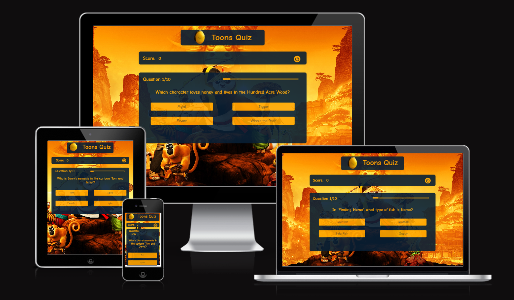

#### The Exit Game Page

The Exit Game Page offers a thoughtful pause in the gaming experience, allowing players to reconsider their decision to leave the quiz:

* `Confirmation Prompt`: Players are greeted with a straightforward question, "Are you sure you want to exit the game?", ensuring that the exit is intentional and not accidental.

* `Yes or No Options`: Two clear choices are provided. Selecting "Yes" directs players back to the Home Page, effectively exiting the game. Choosing "No" keeps the game session active, and players are returned to their current position in the quiz.

* `Preservation of Game State`: For those who choose to continue playing, the game's current state, including scores and progress, is preserved, allowing for a seamless return to the quiz.

* `Visual Consistency`: The page maintains the website's overall design theme, ensuring a cohesive user experience even in decision-making moments.

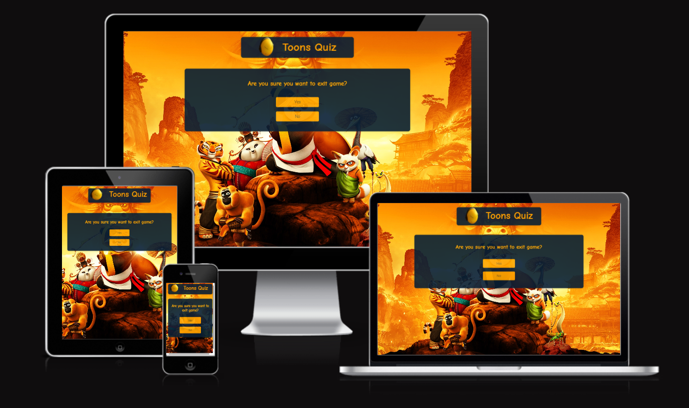

#### The End Game Page

The End Game Page serves as a crucial component of the Toons Quiz Game, marking the culmination of a player's quiz journey. It's designed to provide a satisfying conclusion to the game while encouraging further engagement. Here's an overview of its features:

* `Quiz Completion Acknowledgment`: As players reach the end of their quiz journey, they're greeted with a congratulatory message that acknowledges their achievement. This message adds a personal touch, enhancing the overall gaming experience.

* `Final Score Display`: The page prominently displays the player's final score, offering instant feedback on their performance. This feature motivates players to reflect on their quiz journey and sets a benchmark for future attempts.

* `Username Input for High Score Submission`: A simple and intuitive input field allows players to enter their name or username, attaching a personal identity to their achieved score. This inclusion fosters a sense of community among players competing for high scores.

* `Save High Score Option`: With a clearly labeled button, players can effortlessly save their scores to the High Scores list. This not only immortalizes their achievement but also propels a competitive spirit by encouraging players to outdo each other.

* `Play Again Button`: To keep the engagement cycle ongoing, the End Game Page offers a "Play Again" option, allowing players to dive back into the quiz with ease. This feature is essential for maintaining user interest and replay value.

* `Navigation to Home or Difficulty Selection`: For those looking to adjust their challenge level or explore other parts of the game, convenient navigation options are provided, ensuring a seamless user experience.

* `Dark/Light Theme Toggle`: Consistent with the rest of the game, the End Game Page supports theme customization, allowing players to choose their preferred visual mode for comfort and accessibility.

* `Background Music Continuity`: Echoing the game's emphasis on a cohesive auditory experience, the background music continues to play, maintaining the game's ambiance. Players have the option to toggle the sound settings according to their preference.

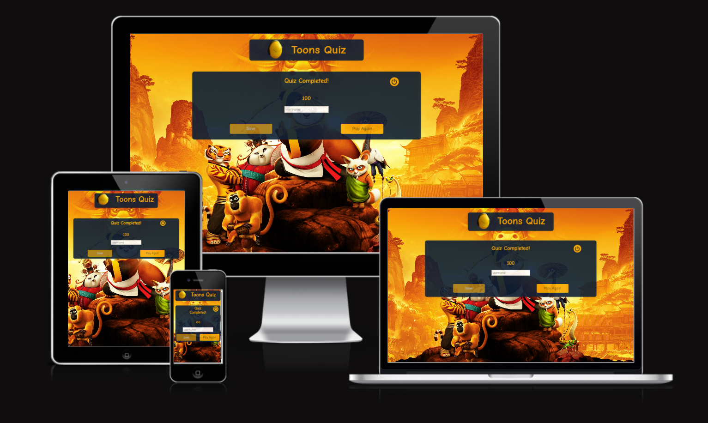

#### The Settings Page

The Settings Page is designed to enhance player control and customisation of the gaming experience, featuring:

* `Sound Control`: Offers an intuitive toggle for sound effects, allowing players to choose whether they prefer background music during the quiz. This feature respects the player's preference for an auditory backdrop.

* `Theme Selection`: Players can switch between light and dark themes, accommodating different visual preferences and enhancing the accessibility of the game. The dark theme offers a restful visual alternative, especially in low-light conditions, contributing to a comfortable gaming experience.

* `Responsive Design`: Just like the rest of the website, the settings page is fully responsive, ensuring that players can easily adjust their preferences across various devices and screen sizes.

* `Immediate Feedback`: Changes made in the settings are immediately applied, giving players a real-time preview of their adjustments. This immediate feedback ensures a smooth and satisfying customisation experience.

* `Preservation of Preferences`: Players' settings are saved locally, ensuring that their preferences are maintained across gaming sessions. This thoughtful feature eliminates the need for players to reconfigure their settings each time they return to the game.

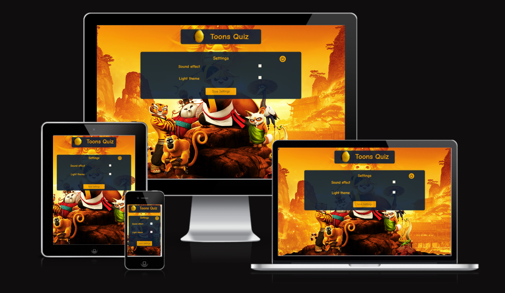

### Future Implementations

Looking ahead, the Toons Quiz Game is poised for further enhancements that aim to enrich the user experience, expand content, and improve accessibility. Here are some of the anticipated future implementations:

* `Personalised Player Profiles`: Introduction of user profiles that allow players to track their progress, save game states, and customise their quiz experiences based on preferences and history.

* `Wider Question Database`: Expansion of the quiz database to include a broader range of cartoons, spanning more eras and genres, ensuring fresh and challenging trivia for all levels of cartoon aficionados.

* `Social Sharing Features`: Integration of social sharing capabilities, enabling players to share their scores and favorite moments on social media platforms, fostering a community of cartoon trivia lovers.

* `Multiplayer Mode`: Development of a multiplayer feature that allows users to compete against friends or random players in real-time, adding a competitive edge and social interaction to the game.

* `Custom Quiz Creation`: Implementation of a tool for users to create and share their own quiz questions, encouraging community engagement and content diversity.

* `Advanced Progress Tracking`: Enhanced tracking of players' progress over time with detailed statistics, leaderboards, and achievement badges, motivating continued play and improvement.

* `Themed Quiz Events`: Regular introduction of themed quiz events centered around specific cartoons, holidays, or current events, keeping the content dynamic and engaging.

### Accessibility

Accessibility forms the cornerstone of the Toons Quiz Game, reflecting a commitment to inclusivity. Understanding the diverse needs of players, I have diligently crafted the game to ensure that everyone, regardless of their abilities, can delight in the challenge and joy that cartoon trivia brings. This commitment to accessibility is manifested through several key practices integrated into the game's coding and design:

* `Semantic HTML`: The foundation of accessibility, semantic HTML, is employed to enhance the structure and presentation of content, making it more understandable and navigable for users with assistive technologies.

* `Responsive Design`: The game's layout is fully responsive, ensuring a seamless experience across a wide range of devices, from desktops to tablets and smartphones. This flexibility guarantees that the game is accessible to players using any device.

* `Clear Navigation`: The website features a straightforward and logical navigation structure, enabling easy movement through the game's sections with both keyboard and mouse inputs.

* `Accessible Forms`: Forms within the game are designed with accessibility in mind, including clear labels, and instructions, facilitating an intuitive interaction for all players.

* `Adaptable Fonts`: Readability is key; hence, font choices and sizes are selected for their clarity. Players have the flexibility to adjust text sizes according to their preferences.

* `Color Contrast`: Adequate contrast between text and background colors is ensured, improving legibility for users, including those with visual impairments.

* `Descriptive Alt Text`: All images come with detailed alternative text descriptions, offering context and clarity for players who use screen readers.

* `Meaningful Descriptions`: Effort is made to ensure that all text content is concise yet descriptive, aiding comprehension without overwhelming users.

- - -

## Technologies Used

The development of Toons Quiz Game leverages a combination of modern web technologies and software tools to ensure a robust, interactive, and user-friendly experience. Here’s a brief overview of the key technologies and tools employed in the game’s creation:

### Languages Used

|  |  |
| -- | --|
|  | The backbone of our game, used to structure the content and layout of the web pages.|
|  | Empowers the visual design of our game, including layouts, colors, and fonts, ensuring an engaging and responsive interface.|
|  | The driving force behind the game's interactivity, enabling dynamic content manipulation, real-time feedback, and seamless user interactions.|
| | |

### Frameworks, Libraries & Programs Used

* [Adobe Express](https://new.express.adobe.com/tools/convert-to-gif) - Used to remove background from logo image and to convert videos to GIF

* [Am I Responsive?](http://ami.responsivedesign.is/) - To show the website image on a range of devices.

* [Balsamiq](https://balsamiq.com/) - Used to create wireframes.

* [Favicon.io](https://favicon.io/) - To create favicon.

* [Git](https://git-scm.com/) - For version control.

* [Github](https://github.com/) - To save and store the files for the website.

* [Google Fonts](https://fonts.google.com/) - To import the fonts used on the website.

* [Google Developer Tools](https://developers.google.com/web/tools) - To troubleshoot and test features, solve issues with responsiveness and styling.

* [Shields.io](https://shields.io/) To add badges to the README

* [VS Code](https://code.visualstudio.com/) - IDE used to create the site.

* [Webpage Spell-Check](https://chrome.google.com/webstore/detail/webpage-spell-check/mgdhaoimpabdhmacaclbbjddhngchjik/related) - a google chrome extension that allows you to spell check your webpage. Used to check the site and the readme for spelling errors.

- - -

## Deployment & Local Development

### Deployment

The site is deployed using GitHub Pages - [Toons Quiz](https://gokwori.github.io/CN-Toons-Quiz/).

To Deploy the site using GitHub Pages:

1. Login (or signup) to Github.
2. Go to the repository for this project, [Toons Quiz](https://gokwori.github.io/CN-Toons-Quiz/).
3. Click the settings button.
4. Select pages in the left hand navigation menu.
5. From the source dropdown select main branch and "/(root)", then press save.
6. The site has now been deployed, please note that this process may take a few minutes before the site goes live.

### Local Development

#### How to Fork

To fork the repository:

1. Log in (or sign up) to Github.
2. Go to the repository for this project, [Toons Quiz](https://gokwori.github.io/CN-Toons-Quiz/)
3. Click the Fork button in the top right corner.

#### How to Clone

To clone the repository:

1. Log in (or sign up) to GitHub.
2. Go to the repository for this project, [Toons Quiz](https://gokwori.github.io/CN-Toons-Quiz/)
3. Click on the code button, select whether you would like to clone with HTTPS, SSH or GitHub CLI and copy the link shown.
4. Open the terminal in your code editor and change the current working directory to the location you want to use for the cloned directory.
5. Type 'git clone' into the terminal and then paste the link you copied in step 3. Press enter.

- - -

## Testing

Please refer to [Testing.md](testing.md) file for all testing carried out.

### Solved Bugs

| No | Bug | Description | Solution Applied | 
| --- | --- | --- | --- | 
| 1 |  | |  |
| 2 |  | |  |
| 3 |  | |  |
| 4 |  | |  |
| 5 |  | |  |
| 6 |  | |  |
| 7 |  | |  |
| 8 |  | |  |
| 9 |  | |  |
| 10 |  | |  |

- - -

## Credits

### Code Used
| No | Component | Comment | Source | Code Snippet | 
| --- | --- | --- | --- | --- |
| 1 |   |   | [#](#) |  |
| 2 |   |   | [#](#) |  |
| 3 |   |   | [#](#) |  |
| 4 |   |   | [#](#) |  |
| 5 |   |   | [#](#) |  |
| 6 |   |   | [#](#) |  |
| 7 |   |   | [#](#) |  |
| 8 |   |   | [#](#) |  |
| 9 |   |   | [#](#) |  |
| 10 |   |   | [#](#) |  |

### Content
| No | Content | Remark | Source | Screenshot |
| --- | --- | --- | --- | --- |
| 1 |  `Logo`  |  The icon used for my logo was gotten from Wallpaper access | [Wallpaper Access](https://wallpaperaccess.com/3d-cartoon#google_vignette)| |
| 2 | `Logo`   |  The logo background was then modified by removing the background colour using Adobe Express | [Adobe Express](https://new.express.adobe.com/tools/remove-background)| |
| 3 | `Favicon`   | Favicon was generated using the favicon converter   | [Favicon](https://favicon.io/favicon-converter/)| |
| 4 |  `Background Images`  | My background images were sourced from  Wall alpha coders  | [Wall Alpha Coders](https://wall.alphacoders.com/big.php?i=690190)| 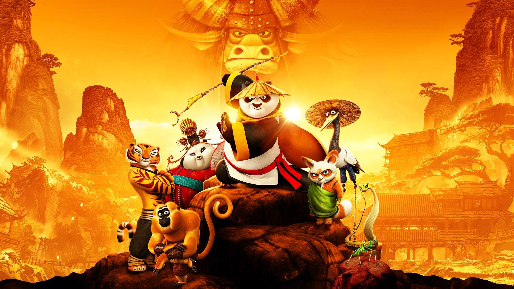 |
| 5 |  `Background Music`  | Background music by Dance Monkey was sourced from Pagla Songs | [Pagla Songs](https://paglasongs.com/dance-monkey-tones-mp3-songs.html)| 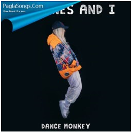|
| 6 |  `Power Button`  | The icon used for my power button was gotten from Font Awesome  | [Font Awesome](https://fontawesome.com/icons)| |

### Acknowledgments

I would like to acknowledge:

* `Jubril Akolade` - My Code Institute Mentor for his guidance and encouragement.